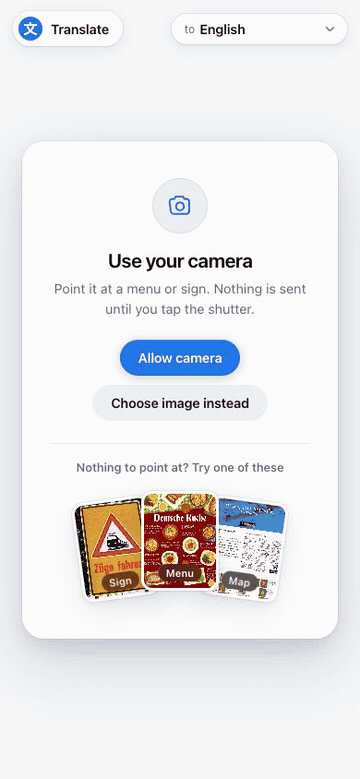
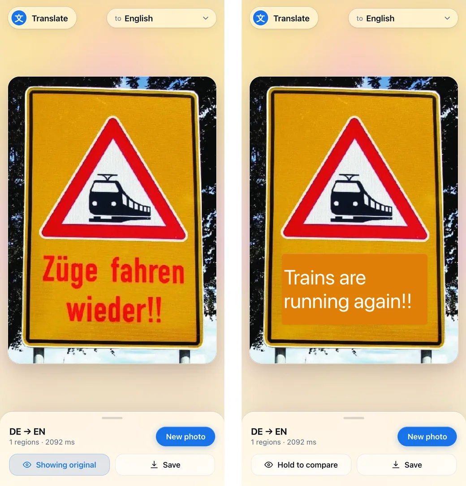
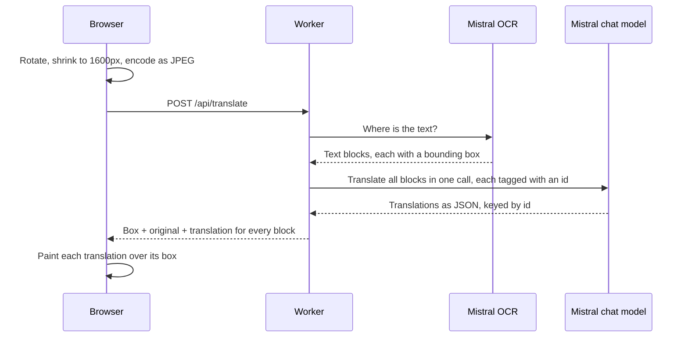
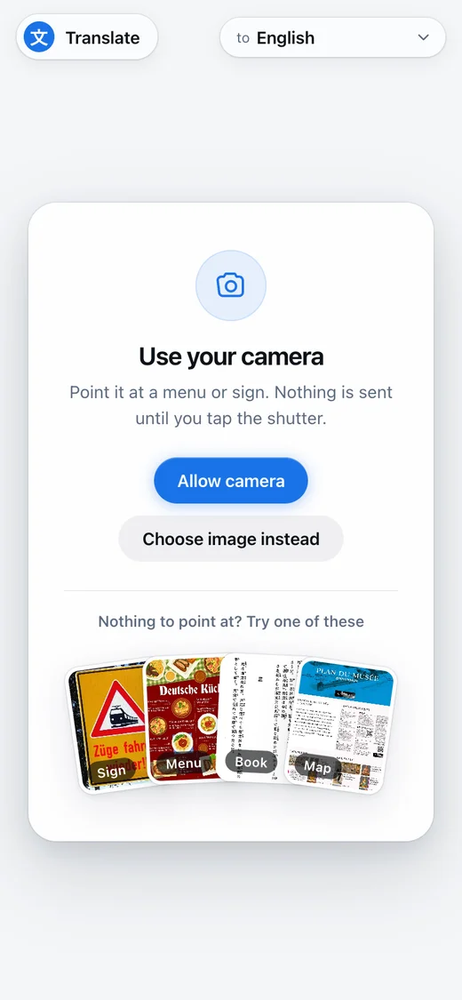

# Translate

Point your phone at a menu or sign and read it in your own language. The translation is drawn straight onto the photo, where the original text was.

<p align="center">
  
</p>

A small web app on [Cloudflare Workers](https://developers.cloudflare.com/workers/), using [Mistral OCR](https://docs.mistral.ai/studio/document-processing/basic_ocr) to find the text and a Mistral chat model to translate it. It installs as an app on your phone and translates into 16 languages.

## How it works

<p align="center">
  
</p>

Each photo makes two model calls, and each model does the part it is good at:



1. **OCR finds *where* the text is.** It returns every block of text with its position in pixels on the image you sent.
2. **The chat model translates *what* it says.** All blocks go in a single request, and each translation comes back under the id of the block it belongs to. Even if the wording changes, it still lands in the right place.
3. **The browser draws the result.** It samples the photo's colour under each box and paints the translation on top, so the result blends into the photo. Press and hold **Hold to compare** to see the original, or tap any line to see both.

All image work (rotating, resizing, encoding, painting) happens in the browser. The Worker only passes text and coordinates between the two models.

```
src/
├── index.ts      the API: validates the photo, calls both models, joins the results
└── mistral.ts    the OCR and translation calls
public/
├── index.html    every screen of the app
└── js/
    ├── camera.js   viewfinder and capture
    ├── image.js    rotate, resize, encode
    └── overlay.js  paints translations over the photo
```

## Run it locally

You need [Node.js 22+](https://nodejs.org/) and a [Mistral API key](https://console.mistral.ai/api-keys). A Cloudflare account is not needed to run it locally.

```sh
git clone https://github.com/megaconfidence/translate.git
cd translate
npm install
echo "MISTRAL_API_KEY=your-key-here" > .env
npm run dev
```



Open **http://localhost:8787**. On a computer you can drop in a photo of your own, or pick one of the sample cards (a German sign and menu, a page from a Japanese novel, or a French map) to try it straight away.

**Trying it on your phone.** Browsers only allow camera access on `localhost` or over HTTPS, so a link like `http://192.168.x.x:8787` will open but cannot use the camera. Instead, run:

```sh
npm run dev -- --tunnel
```

This gives you a temporary public HTTPS link through a [Cloudflare Tunnel](https://developers.cloudflare.com/cloudflare-one/networks/connectors/cloudflare-tunnel/). Open it on your phone. Anyone with the link can use your API key while it is running, so stop it when you are done.

**Changing models.** Both models are set in `wrangler.jsonc` (`OCR_MODEL`, `TRANSLATE_MODEL`). The OCR model must support `include_blocks`, which `mistral-ocr-latest` does.

<br clear="right">
